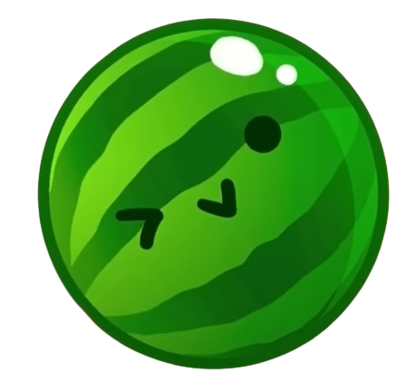

#  スイカ Game (Watermelon Game)

スイカ Game, that you may know under the name Watermelon Game is a game where you drop fruits in a basket. If the same type of fruits touch each other, they merge into a bigger fruit.

Will you manage to get and combine two Watermelons ?

Clone the repo with ``git clone https://github.com/Pappnschlossa/Ryad_Thibaut_C-_Project.git``, and run the main file to try it!

This project was coded in C++ implementing a Qt interface.

## User Input

After running main, the user clicks on the screen wherever he wants to place his next fruit.\
The type of the next fruit is indicated on the top right of the screen.

## Elements of this project we are proud of

- The resizable window (yes it is resizable, try it yourself !)
- 

## Problems we had while working on this project

- Printing with CLion did not work as intended, when running main. We later found out that launching the app in Debug mode fixes this.
- 